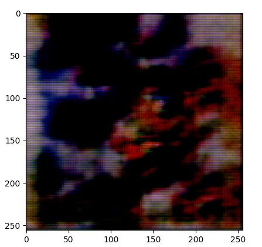
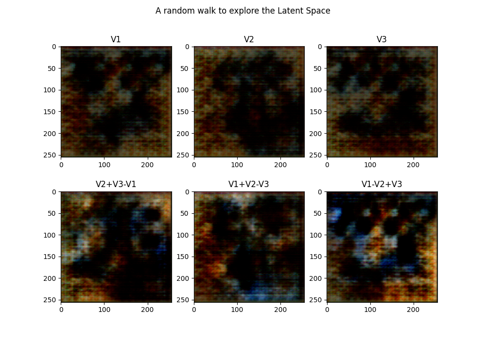

# Pattern Recognition in Abstract Art Works

A generative model that learns the color patterns of various abstract art pieces to generate its own patterns

## Description of Files

| File               | Functionality                                     |
| ------------------ | ------------------------------------------------- |
| Discriminator.py   | Model architecture of the discriminator           |
| Generator.py       | Model architecture of the generator               |
| Data_generator.py  | Dataset class                                     |
| Initialize.py      | Initializer class                                 |
| Random_walk_art.py | Implementation of random walk on the Latent space |
| Training_loops.py  | Training the model                                |
| Transforms.py      | Just messed around with a bunch of transforms     |
| Models             | Contains the .pth model state files               |
| Outputs            | Contains output generated patterns                |
| Random-walks       | Results of random walk in the latent space        |

## Random Walk

A random walk on the latent space was implemented to understand hidden relationships between the color patterns generated after learning the disribution

 <b>Experiment performed after 75 epochs</b> 

The latent space is an embedding space that contains representations of low and high level features. On performing vector arithmetic we can see that a certain color pattern can be obtained from an arithemetic operation of other color patterns. We can also see that V1-V2+V3 gives a slight blue shade , a new pattern hidden in the embedding space

## Results

You can view the run experiments and metric curves [here](https://api.wandb.ai/links/uaena/fc87yhh1)

## Implementation Notes

- Used BCEwithLogits Loss function of Pytorch instead of a sigmoid layer in discriminator for stable results
- Adams Beta 1 parameter changed to 0.5 as per the DCGAN paper
- Learning rate set to 0.0002
- No pooling layers, only strided convolutions used as per the DCGAN paper
- Added dropout regularization with noise parameter set to 0.2
