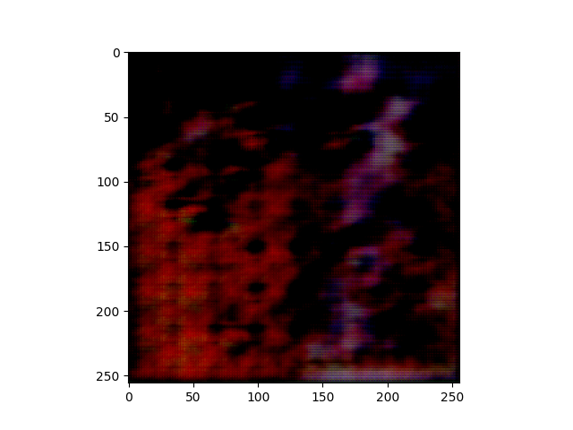
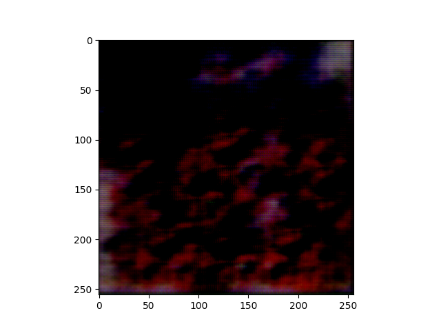
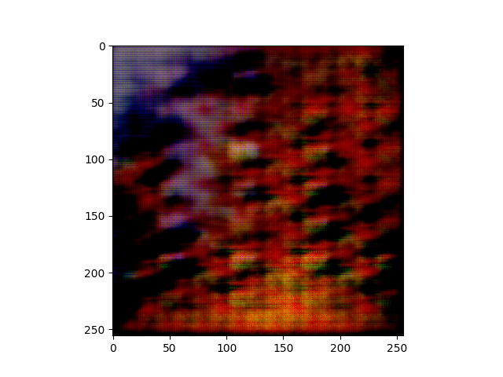

# Pattern Recognition in Abstract Art Works

|Figure 1|Figure 2 | Figure 3  |
|-----|-------|-----|
||||

## Abstract

    Abstract Art is an immensely popular, discussed form of art that often has the ability to depict the emotions of an artist. Many researchers have made attempts to study abstract art in the form of edge detection, brush stroke and emotion recognition algorithms using machine and deep learning. This papers describes the study of a wide distribution of abstract paintings using Generative Adversarial Neural Networks(GAN). GANs have the ability to learn and reproduce a distribution enabling researchers and scientists to effectively explore and study the generated image space. However, the challenge lies in developing an efficient GAN architecture that overcomes common training pitfalls. This paper addresses this challenge by introducing a modified-DCGAN (mDCGAN) specifically designed for high-quality artwork generation. The approach involves a thorough exploration of the modifications made, delving into the intricate workings of DCGANs, optimisation techniques, and regularisation methods aimed at improving stability and realism in art generation enabling effective study of generated patterns. The proposed mDCGAN incorporates meticulous adjustments in layer configurations and architectural choices, offering tailored solutions to the unique demands of art generation while effectively combating issues like mode collapse and gradient vanishing. The evaluation results of mDCGAN demonstrates a remarkable reduction in mode collapse occurrences when compared to the standard DCGAN configuration. This reduction significantly broadens the range of generated artworks, indicating the model's enhanced diversity and stability. Further this paper explores the generated latent space by performing random walks to understand vector relationships between brush strokes and colours in the abstract art space and a statistical analysis of unstable outputs after a certain period of GAN training and compare its significant difference. These findings validate the effectiveness of the proposed approach, emphasising its potential to revolutionise the field of digital art generation and digital art ecosystem.

## Description of Files

| File               | Functionality                                     |
| ------------------ | ------------------------------------------------- |
|Research_utils | Contains achitecture diagrams, outputs and random walk experiments|
| discriminator.py   | Model architecture of the discriminator           |
| generator.py       | Model architecture of the generator               |
| art_dataset.py  | Dataset class                                     |
| initialize.py      | Initializer class                                 |
| random_walk_art.py | Implementation of random walk on the Latent space |
| training_loops.py  | Training the model                                |
| models             | Contains the .pth model state files               |
|post_process.py| Contains source code for Gaussian and Median smoothening|

## Experiments

You can view the run experiments and metric curves [here](https://api.wandb.ai/links/uaena/fc87yhh1)